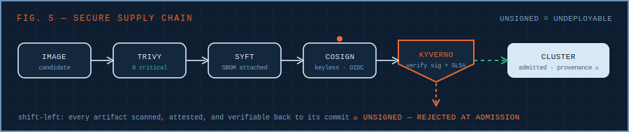

<!-- ╔══════════════════════════════════════════════════════════════╗
     Profile README for github.com/AbdullahAIOps
     Repo MUST be named exactly "AbdullahAIOps" to show on your profile.
     All visuals are self-hosted SVGs in /assets — they never rate-limit.
     ╚══════════════════════════════════════════════════════════════╝ -->

  

  

  

📍 Based in Pakistan &nbsp;·&nbsp; ready to relocate to the EU (🇩🇪 Blue Card eligible) or the GCC &nbsp;·&nbsp; open to remote & on-site

## About

> **Cloud platforms that are reliable by design, secure by default, and observable end-to-end.**

DevOps & AIOps Engineer focused on building scalable cloud infrastructure, automating delivery pipelines, and keeping systems reliable, observable, and secure. I work across **AWS** and **Azure**, containerize with **Docker** and **Kubernetes**, and treat infrastructure as code with **Terraform** — wiring in security and intelligent operations from day one, not as an afterthought.

- 🔧 &nbsp;Designing CI/CD pipelines, container platforms, and infrastructure-as-code
- ☁️ &nbsp;Hands-on across **AWS** and **Azure** — landing zones, networking, IAM, cost
- 🔐 &nbsp;Shift-left **DevSecOps** — supply-chain scanning, signing, policy-as-code, hardening
- 🤖 &nbsp;Applying **AIOps** — anomaly detection, forecasting, and self-healing automation
- 📈 &nbsp;Obsessed with **SLOs**, error budgets, and full-stack observability
- 🌍 &nbsp;Open to **DevOps · Cloud · SRE** roles in the **EU & GCC** — relocation and **visa sponsorship welcome**

## Production Architecture

A reference of how I assemble platforms — a multi-node Kubernetes cluster, provisioned with Terraform, delivered through GitOps, secured at the edge, and observed end-to-end.

## Tech Stack

**Cloud & Infrastructure**

**Containers & Orchestration**

**CI/CD & Automation**

**Monitoring & Observability**

**Languages & Tools**

## How I Ship

From commit to production — automated, scanned, and observable at every stage.

## Secure Software Supply Chain

Security shifted left — every artifact is scanned, attested, signed, and admitted only when it passes policy.

## AIOps — Intelligent Operations

Telemetry in, insight out — anomaly detection and forecasting that trigger root-cause analysis and self-healing.

## GitHub Stats

## Featured Projects

> Production-grade flagship work — every repo ships full Terraform / Helm / pipeline code, a clear README, an architecture diagram, and ADRs.

| Project | Highlights | Stack |
|---|---|---|
| **[eks-gitops-platform](https://github.com/AbdullahAIOps/eks-gitops-platform)** | Production EKS provisioned with Terraform and delivered via **ArgoCD** app-of-apps GitOps — keyless **OIDC** CI/CD, IRSA, External Secrets, and supply-chain scanning baked in | `Terraform` · `EKS` · `ArgoCD` · `Helm` · `OIDC` |
| **[multicloud-terraform-landing-zone](https://github.com/AbdullahAIOps/multicloud-terraform-landing-zone)** | Versioned Terraform modules spanning **AWS + Azure**, Terragrunt DRY multi-environment, with policy-as-code (**OPA/Conftest**) and cost gates on every PR | `Terraform` · `Terragrunt` · `AWS` · `Azure` · `OPA` |
| **[observability-slo-platform](https://github.com/AbdullahAIOps/observability-slo-platform)** | Unified metrics, logs & traces (**Prometheus · Loki · Tempo · OpenTelemetry**) with multi-burn-rate **SLO** alerting and error budgets | `Prometheus` · `Grafana` · `Loki` · `Tempo` · `OTel` |
| **[devsecops-supply-chain](https://github.com/AbdullahAIOps/devsecops-supply-chain)** | End-to-end secure supply chain: SAST/SCA, secret + IaC scanning, **SBOMs**, keyless **Cosign** signing, **SLSA** provenance, and **Kyverno** admission gates | `Cosign` · `Syft` · `Trivy` · `Kyverno` · `SLSA` |
| **aks-internal-developer-platform** &nbsp;🚧 | _Coming soon_ — Azure **AKS** internal developer platform: Workload Identity, Key Vault CSI, Azure Pipelines + GitHub OIDC, and Backstage-style self-service | `AKS` · `Azure` · `Backstage` · `Workload Identity` |

 

